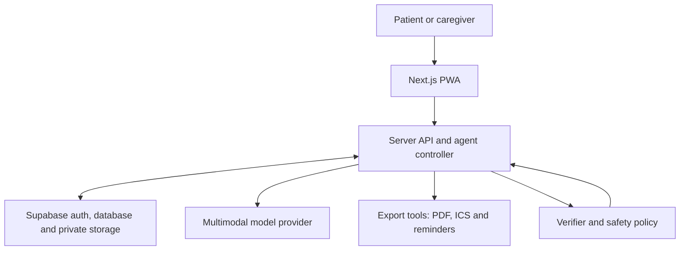

# Healthfolio — Technical Architecture Document

## 1. Architecture goals

Healthfolio is designed for a solo developer. It uses one full-stack TypeScript application, managed authentication/database/storage, one agent controller and a small tool registry. The architecture prioritizes an observable agent loop, source traceability, security and reproducibility over premature scale.

## 2. System context



## 3. Recommended stack

Pin exact dependency versions in `package-lock.json` when scaffolding; do not use floating `latest` tags in production.

| Layer | Choice | Reason |
|---|---|---|
| Language | TypeScript | One language across UI, API, schemas and agent tools |
| Web framework | Next.js App Router | Full-stack application without a separate backend repository |
| UI | React + Tailwind CSS | Fast responsive implementation and consistent tokens |
| Components | Accessible headless primitives only where needed | Keyboard support without a heavy design system |
| Validation | Zod | Runtime validation for forms, APIs and model responses |
| Auth | Supabase Auth | Email/password auth and session management |
| Database | Supabase PostgreSQL | Managed relational data and row-level security |
| File storage | Private Supabase Storage bucket | Signed access and ownership policies |
| AI adapter | Provider-neutral server interface | Model can be changed without rewriting product logic |
| Document parsing | PDF text extraction + OCR; multimodal model when needed | Cheap deterministic extraction first, vision fallback second |
| PDF export | Server-side PDF library | Repeatable consultation brief output |
| Calendar | Standards-compliant `.ics` generation | Real action without OAuth complexity |
| Testing | Vitest + React Testing Library + Playwright | Unit, component and end-to-end coverage |
| Quality | ESLint + Prettier + TypeScript strict mode | Consistency for AI-generated code |
| Deployment | One Next.js host plus Supabase project | Minimal operational surface |

## 4. Logical components

### Web client

- Authentication screens
- Goal and appointment form
- Multi-file uploader
- Processing/activity UI
- Verification queue
- Timeline
- Brief/checklist viewer
- PDF and ICS downloads
- Privacy settings

### Server API

- Authorizes every request
- Creates signed upload/download URLs
- Validates MIME type, size and ownership
- Starts/resumes agent runs
- Calls the model through an adapter
- Executes allowlisted tools
- Generates exports
- Writes redacted audit events

### Agent controller

The controller is an explicit state machine, not an unrestricted autonomous loop.

```text
INTAKE → INGEST → EXTRACT → REVIEW_REQUIRED → PLAN
       → EXECUTE → VERIFY → ADAPT → COMPLETE | BLOCKED
```

Maximum steps and retries are configured server-side. Every tool call is validated by a Zod schema. The model suggests one next action, but code checks whether it is permitted in the current state.

### Verifier

The verifier checks:

- Tool returned a successful status
- Output matches schema
- Evidence reference exists
- Confidence meets threshold
- Required user approval exists
- No forbidden medical advice is present
- Goal has remaining tasks

### Safety policy

- Blocks diagnosis, treatment and medication-change outputs
- Treats document content as untrusted data
- Prevents arbitrary tool or URL execution
- Converts emergency/urgent prompts into a fixed seek-professional-help response
- Requires user confirmation for uncertain facts

## 5. Agent state

```ts
type AgentState = {
  runId: string;
  userId: string;
  portfolioId: string;
  goal: string;
  status: "intake" | "extracting" | "review_required" | "executing" | "blocked" | "complete";
  appointment?: { startsAt: string; timezone: string; specialty?: string };
  documentIds: string[];
  verifiedEventIds: string[];
  uncertainExtractionIds: string[];
  plan: PlannedAction[];
  currentStep: number;
  failedActions: ToolFailure[];
  retryCount: number;
};
```

Do not store hidden chain-of-thought. Store concise operational summaries: observation, selected action, tool result, verification and adaptation.

## 6. Tool contract

Each tool implements:

```ts
interface AgentTool<Input, Output> {
  name: string;
  inputSchema: ZodSchema<Input>;
  execute(input: Input, context: AuthorizedContext): Promise<Output>;
  verify(output: Output): VerificationResult;
}
```

Tools are registered in code. The model receives the allowlist, never filesystem, shell, SQL or unrestricted HTTP access.

## 7. Project structure

```text
healthfolio/
├── app/
│   ├── (marketing)/
│   │   └── page.tsx
│   ├── (auth)/
│   │   ├── sign-in/page.tsx
│   │   └── sign-up/page.tsx
│   ├── (app)/
│   │   ├── layout.tsx
│   │   ├── dashboard/page.tsx
│   │   ├── prepare/page.tsx
│   │   ├── runs/[runId]/page.tsx
│   │   ├── timeline/page.tsx
│   │   ├── brief/[briefId]/page.tsx
│   │   └── settings/page.tsx
│   ├── api/
│   │   ├── documents/route.ts
│   │   ├── documents/[id]/replace/route.ts
│   │   ├── runs/route.ts
│   │   ├── runs/[id]/step/route.ts
│   │   ├── extractions/[id]/confirm/route.ts
│   │   ├── briefs/[id]/pdf/route.ts
│   │   └── calendar/[appointmentId]/ics/route.ts
│   ├── error.tsx
│   ├── global-error.tsx
│   └── layout.tsx
├── components/
│   ├── activity/
│   ├── documents/
│   ├── forms/
│   ├── timeline/
│   └── ui/
├── lib/
│   ├── agent/
│   │   ├── controller.ts
│   │   ├── policy.ts
│   │   ├── state.ts
│   │   ├── verifier.ts
│   │   └── prompts.ts
│   ├── ai/
│   │   ├── provider.ts
│   │   ├── schemas.ts
│   │   └── safety.ts
│   ├── documents/
│   │   ├── ingest.ts
│   │   ├── ocr.ts
│   │   └── evidence.ts
│   ├── tools/
│   │   ├── registry.ts
│   │   ├── document-extract.ts
│   │   ├── timeline-build.ts
│   │   ├── brief-generate.ts
│   │   ├── reminder-create.ts
│   │   ├── calendar-export.ts
│   │   └── pdf-export.ts
│   ├── supabase/
│   │   ├── browser.ts
│   │   ├── server.ts
│   │   └── admin.ts
│   ├── auth.ts
│   ├── errors.ts
│   └── env.ts
├── supabase/
│   ├── migrations/
│   ├── policies.sql
│   └── seed.sql
├── public/
│   ├── icons/
│   └── manifest.webmanifest
├── tests/
│   ├── fixtures/
│   ├── unit/
│   ├── integration/
│   └── e2e/
├── docs/
│   ├── architecture.md
│   ├── safety.md
│   └── demo-script.md
├── .env.example
├── package.json
├── README.md
└── tsconfig.json
```

## 8. Database schema

All IDs are UUIDs. All timestamps are timezone-aware. Every user-owned table includes `user_id` even when ownership could be inferred; this simplifies RLS and audits.

### `profiles`

| Field | Type | Notes |
|---|---|---|
| id | uuid | Primary key; equals authenticated user ID |
| display_name | text | Optional |
| timezone | text | Default `Asia/Kolkata` for demo |
| locale | text | Default `en-IN` |
| created_at | timestamptz | Server generated |
| deleted_at | timestamptz | Soft-delete workflow marker |

### `portfolios`

| Field | Type | Notes |
|---|---|---|
| id | uuid | Primary key |
| user_id | uuid | Owner |
| label | text | Example: `My Healthfolio` |
| subject_relationship | text | `self` for MVP |
| created_at | timestamptz | Server generated |

### `documents`

| Field | Type | Notes |
|---|---|---|
| id | uuid | Primary key |
| user_id | uuid | Owner |
| portfolio_id | uuid | Parent portfolio |
| original_name | text | Sanitized display name |
| storage_path | text | Private object path |
| mime_type | text | Allowlisted type |
| size_bytes | bigint | Enforce limit |
| sha256 | text | Duplicate detection/integrity |
| document_type | text | prescription, lab_report, discharge_summary, other |
| status | text | uploaded, processing, review_required, verified, failed, excluded |
| page_count | integer | Nullable until parsed |
| created_at | timestamptz | Server generated |

### `extractions`

| Field | Type | Notes |
|---|---|---|
| id | uuid | Primary key |
| user_id | uuid | Owner |
| document_id | uuid | Source document |
| page_number | integer | Evidence page |
| field_type | text | date, instruction, test, clinician, event, other |
| raw_value | text | Extracted text; sensitive |
| normalized_value | jsonb | Validated structured representation |
| confidence | numeric | 0 to 1 |
| verification_status | text | pending, user_confirmed, user_corrected, rejected |
| evidence_locator | jsonb | Page and optional bounding box/text span |
| created_at | timestamptz | Server generated |

### `medical_events`

| Field | Type | Notes |
|---|---|---|
| id | uuid | Primary key |
| user_id | uuid | Owner |
| portfolio_id | uuid | Parent portfolio |
| event_date | date | Can be approximate only when explicitly marked |
| event_type | text | consultation, test, report, prescription, discharge, follow_up, other |
| title | text | Neutral factual title |
| description | text | No clinical interpretation |
| source_extraction_ids | uuid[] | Evidence references |
| verification_status | text | verified, disputed, incomplete |
| created_at | timestamptz | Server generated |

### `appointments`

| Field | Type | Notes |
|---|---|---|
| id | uuid | Primary key |
| user_id | uuid | Owner |
| portfolio_id | uuid | Parent portfolio |
| starts_at | timestamptz | Appointment time |
| timezone | text | IANA timezone |
| specialty | text | Optional |
| clinician_name | text | Optional |
| location | text | Optional |
| status | text | planned, changed, completed, cancelled |

### `agent_runs`

| Field | Type | Notes |
|---|---|---|
| id | uuid | Primary key |
| user_id | uuid | Owner |
| portfolio_id | uuid | Parent portfolio |
| goal | text | User goal |
| state | jsonb | Validated state snapshot |
| status | text | queued, running, waiting_for_user, blocked, complete, failed |
| current_step | integer | Bounded counter |
| created_at | timestamptz | Start |
| completed_at | timestamptz | Nullable |

### `agent_steps`

| Field | Type | Notes |
|---|---|---|
| id | uuid | Primary key |
| user_id | uuid | Owner |
| run_id | uuid | Parent run |
| sequence | integer | Ordered step |
| phase | text | observe, decide, act, verify, adapt |
| public_summary | text | No hidden chain-of-thought |
| tool_name | text | Nullable |
| tool_status | text | pending, succeeded, failed, blocked |
| error_code | text | Nullable, non-secret |
| created_at | timestamptz | Server generated |

### `briefs`

| Field | Type | Notes |
|---|---|---|
| id | uuid | Primary key |
| user_id | uuid | Owner |
| portfolio_id | uuid | Parent portfolio |
| appointment_id | uuid | Optional |
| content | jsonb | Structured sections and evidence IDs |
| status | text | draft, approved, stale |
| version | integer | Increment on regeneration |
| created_at | timestamptz | Server generated |

### `reminders`

| Field | Type | Notes |
|---|---|---|
| id | uuid | Primary key |
| user_id | uuid | Owner |
| appointment_id | uuid | Optional |
| remind_at | timestamptz | When reminder becomes due |
| channel | text | in_app for MVP |
| status | text | scheduled, completed, cancelled, failed |
| message | text | Non-clinical task reminder |

### `consents`

| Field | Type | Notes |
|---|---|---|
| id | uuid | Primary key |
| user_id | uuid | Owner |
| consent_type | text | terms, privacy, ai_processing |
| policy_version | text | Exact version accepted |
| granted_at | timestamptz | Server generated |
| revoked_at | timestamptz | Nullable |

### `audit_events`

| Field | Type | Notes |
|---|---|---|
| id | uuid | Primary key |
| user_id | uuid | Owner or null for pre-auth security event |
| action | text | upload, read, update, export, delete, auth event |
| resource_type | text | Never store raw document text here |
| resource_id | uuid | Nullable |
| metadata | jsonb | Redacted operational metadata |
| created_at | timestamptz | Server generated |

## 9. Relationships

- One profile owns one or more portfolios.
- A portfolio contains documents, events, appointments, runs and briefs.
- A document contains many extraction records.
- A medical event references one or more verified extractions.
- An agent run contains ordered agent steps.
- A brief references events through IDs, not duplicated unsupported claims.

## 10. API surface

| Method | Route | Purpose |
|---|---|---|
| POST | `/api/documents` | Validate metadata and create private upload intent |
| POST | `/api/documents/:id/replace` | Replace an unreadable document with ownership check |
| POST | `/api/runs` | Create a run for a goal and selected documents |
| POST | `/api/runs/:id/step` | Execute one bounded agent step |
| POST | `/api/extractions/:id/confirm` | Confirm, correct or reject an extracted fact |
| GET | `/api/timeline` | Return verified events for current portfolio |
| POST | `/api/briefs` | Generate/regenerate a source-linked brief |
| GET | `/api/briefs/:id/pdf` | Produce an authorized PDF |
| GET | `/api/calendar/:appointmentId/ics` | Produce an authorized calendar file |

Never place sensitive document content in URL query strings.

## 11. Environment variables

```dotenv
NEXT_PUBLIC_APP_URL=
NEXT_PUBLIC_SUPABASE_URL=
NEXT_PUBLIC_SUPABASE_ANON_KEY=
SUPABASE_SERVICE_ROLE_KEY=
AI_PROVIDER=
AI_API_KEY=
AI_MODEL_TEXT=
AI_MODEL_VISION=
DOCUMENT_MAX_BYTES=10485760
AGENT_MAX_STEPS=12
AGENT_MAX_RETRIES=2
EXTRACTION_CONFIDENCE_THRESHOLD=0.85
APP_ENCRYPTION_KEY=
DEMO_MODE=true
```

Rules:

- Commit `.env.example`, never `.env.local`.
- `SUPABASE_SERVICE_ROLE_KEY`, model keys and encryption key are server-only.
- Validate environment variables at startup.
- Keep production and demo Supabase projects separate.
- Rotate any credential accidentally exposed in logs or Git history.

## 12. Processing sequence

1. Browser asks server for an upload intent.
2. Server checks session, consent, MIME type and size.
3. File is stored in a private user-owned path.
4. Server creates document row and queues extraction.
5. Deterministic parser extracts available text.
6. Vision/OCR fallback handles image-only or low-quality pages.
7. Model returns a strict structured extraction with evidence locators.
8. Verifier applies schema, confidence and safety checks.
9. Uncertain facts enter review queue.
10. Only confirmed facts create timeline events.
11. Agent generates brief/checklist and executes exports.

## 13. Failure strategy

| Failure | System response |
|---|---|
| Unsupported file | Reject before upload with allowed formats |
| File too large | Reject with current limit and compression guidance |
| Malware/invalid signature | Quarantine/reject; do not parse |
| OCR low confidence | Request clearer image or manual correction |
| Model timeout | Mark step retryable; retry at most configured limit |
| Invalid model JSON | One constrained repair attempt, then block safely |
| Storage/API outage | Preserve run state and show retry action |
| PDF/ICS export failure | Keep approved brief; allow export retry |
| Safety violation | Discard output and use deterministic safe response |

## 14. Testing strategy

- Unit tests for schemas, confidence thresholds, policy and ICS generation
- Tool-contract tests for success, timeout and malformed output
- Integration tests for auth/RLS and document ownership
- Prompt-injection fixtures embedded in sample documents
- Safety tests for diagnosis, treatment and dose-change requests
- End-to-end happy path and blurred-document recovery
- Mobile viewport tests at 360 × 800
- Ten full demo rehearsals with a reset script

## 15. Deployment and reproducibility

- Provide SQL migrations and fictional seed data.
- Provide `.env.example` with descriptions, not values.
- Include `npm install`, `npm run dev`, `npm run test` and `npm run build` instructions.
- Provide a demo account or local seed flow without including credentials in the repository.
- Include a deterministic sample extraction fixture only as an explicitly labeled fallback; never present a fixture as a live model result.

