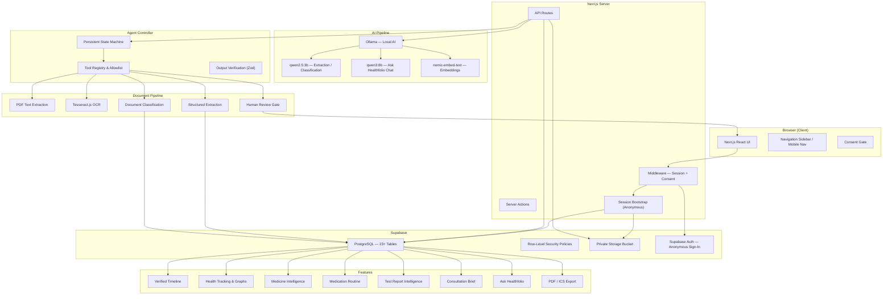

# Healthfolio — System Architecture

## Overview

Healthfolio is a full-stack web application built on Next.js 14 App Router with TypeScript strict mode, Tailwind CSS, Supabase (PostgreSQL, private Storage, Row-Level Security), and local Ollama for AI processing. The architecture is designed around a controlled agent loop that processes medical documents through multiple stages of extraction, validation, and human review.

## Architecture Diagram



## Layers in Detail

### 1. Responsive Web Interface

- **Framework:** Next.js 14 App Router
- **Styling:** Tailwind CSS with custom design tokens (colors, spacing, typography)
- **Animation:** Framer Motion
- **Responsive:** 320px mobile to 1920px desktop; bottom navigation on mobile, sidebar on desktop
- **Accessibility:** Skip link, semantic landmarks, focus management, aria-live regions, reduced-motion support

### 2. Authentication and Session Layer

- **Primary:** Supabase anonymous sign-in — no email required on first visit
- **Optional:** Email/password sign-up and sign-in
- **Bootstrap flow:** Browser → session bootstrap API → anonymous authentication → cookie persistence → user lookup → portfolio creation (idempotent)
- **Middleware:** Protects all `(app)` routes; redirects unauthenticated users; enforces consent before document upload
- **Session persistence:** HTTP-only cookies with Supabase SSR client; survives page refresh and multiple tabs

### 3. Next.js API Routes

All API routes live under `src/app/api/` and are server-side only:

| Route Category | Purpose |
|---|---|
| `/api/portfolios` | Create and retrieve user portfolio |
| `/api/consent` | Record versioned AI-processing consent |
| `/api/documents` | Document upload intent and signed URL generation |
| `/api/upload-sessions` | Multi-page upload session management |
| `/api/runs` | Create and list agent processing runs |
| `/api/runs/[id]/step` | Execute a single agent step |
| `/api/extractions` | Structured extraction records |
| `/api/health-tracking/*` | Measurements, trends, graphs |
| `/api/medicines` | Medicine intelligence lookups |
| `/api/routines` | Medication routine plans |
| `/api/reports` | Test report processing |
| `/api/ask` | Ask Healthfolio conversational queries |
| `/api/timeline` | Verified health timeline |
| `/api/appointments` | Appointment management |
| `/api/briefs` | Consultation brief generation |
| `/api/calendar` | ICS calendar export |
| `/api/pdf` | PDF export |
| `/api/ai/*` | AI provider status and health checks |

### 4. Supabase PostgreSQL

- **23+ tables** covering portfolios, documents, extractions, measurements, medicines, routines, appointments, briefs, agent runs/steps, and audit events
- **122 RLS policies** enforcing user ownership on every table
- **Indexes** for performance on frequently queried columns
- **RPC functions** for measurement review and health trend calculations
- **Unique constraints** preventing duplicate portfolios and records

### 5. Private Supabase Storage

- **Bucket:** `documents` (private, not public)
- **Size limit:** 10 MB per file
- **Allowed types:** PDF, PNG, JPEG, WEBP
- **Access:** User-scoped paths (`{user_id}/{document_id}/{filename}`)
- **Signed URLs:** Short-lived (1 hour) for document preview; 5 minutes for source evidence
- **Policies:** INSERT, SELECT, UPDATE, DELETE — all scoped to `auth.uid()`

### 6. Agent Controller

The agent controller is a persistent state machine that orchestrates document processing:

**States:**
- `INTAKE` → `INGEST` → `EXTRACT` → `REVIEW_REQUIRED` → `PLAN` → `EXECUTE` → `VERIFY` → `ADAPT` → `COMPLETE` | `BLOCKED`

**Key properties:**
- State is persisted to the database after every step
- Each step selects exactly one tool from the allowlist
- Tool inputs and outputs are validated through Zod schemas
- Failed steps retry within configured limits
- Interrupted runs resume from the last persisted state
- Human review pauses execution until the user confirms or corrects
- Completed runs cannot be restarted

### 7. Tool Registry

All tools are registered in a single authoritative source (`src/lib/tools/tool-names.ts`):

| Tool | Purpose |
|---|---|
| `document.ingest` | Process newly uploaded documents |
| `document.extract` | Extract structured data |
| `document.replace` | Replace a document with clearer copy |
| `timeline.build` | Build verified health timeline |
| `clarification.request` | Request user review or correction |
| `brief.generate` | Generate consultation brief |
| `checklist.generate` | Generate preparation checklist |
| `reminder.create` | Create appointment reminder |
| `calendar.export_ics` | Export calendar event |
| `pdf.export` | Export brief as PDF |

Each tool is permitted only in specific agent states. Medical actions (diagnosis, prescription, dose calculation) are impossible through the registry.

### 8. PDF Text Extraction

- **Library:** pdf-parse for native text PDFs
- **Process:** Detect text layer → extract page-by-page text → store evidence with page numbers
- **Fallback:** If no text layer is detected, redirect to OCR pipeline

### 9. OCR Engine

- **Library:** Tesseract.js (client-side worker, runs in browser)
- **Languages:** English (configurable)
- **Output:** Extracted text with confidence scores per word and line
- **Quality gates:** Below-threshold confidence triggers orientation correction retry or user review request
- **Worker management:** Workers are terminated after processing to prevent memory leaks

### 10. Ollama Model Provider

Three models serve different purposes:

| Model | Use | When |
|---|---|---|
| `qwen2.5:3b` | Document classification, structured extraction, intent classification | Every document processing step |
| `qwen3:8b` | Ask Healthfolio conversational chat | User chat queries |
| `nomic-embed-text` | Text embeddings for similarity search | Document and medicine matching |

**Interface:** `AIProvider` abstraction with `OllamaProvider` implementation. Supports structured JSON output, timeout, retry, and malformed response repair.

### 11. Structured Zod Validation

Every AI output is validated through Zod schemas:
- Document classification → `DocumentClassificationSchema`
- Extracted measurements → `MeasurementExtractionSchema`
- Medicine extraction → `MedicineExtractionSchema`
- Ask Healthfolio intent → `AskIntentSchema`
- Agent next-action → `AgentActionSchema`
- Schedule extraction → `ScheduleExtractionSchema`

Invalid responses are rejected; at most one repair attempt is made before failing.

### 12. Evidence Storage

Every extracted fact stores:
- Source document ID
- Source page number
- Evidence text (exact excerpt from the document)
- Confidence score
- Verification status (unverified, verified, corrected, rejected)

Evidence is never overwritten. Corrections create revision history entries.

### 13. Human Review Gate

When confidence falls below the configured threshold (`EXTRACTION_CONFIDENCE_THRESHOLD`):
- The fact is marked as requiring review
- The agent pauses in `REVIEW_REQUIRED` state
- The user sees the source page and the uncertain value
- The user confirms, corrects, or rejects the value
- The agent resumes from persistent state

### 14. Health Tracking

- Stores verified measurements with source evidence
- Links each measurement to its source document and page
- Tracks numeric values, units, comparators, and reference ranges
- Excludes rejected and invalidated measurements from graphs
- Graphs show only verified, user-confirmed data points
- Time-range filtering (1 month, 3 months, 6 months, 1 year, all)
- Trend indicators based on consecutive verified measurements

### 15. Ask Healthfolio

- Conversational interface using `qwen3:8b`
- Intent router classifies queries into: product help, medicine lookup, test lookup, personal record question, emergency, etc.
- Typo correction for medicine names (metformine → metformin) and test names (hemoglobine alc → HbA1c)
- Bounded conversation memory for follow-up references
- Personal record retrieval from verified measurements only
- Safety boundaries: no diagnosis, no prescribing, no dose calculation
- Prompt injection protection: user messages are treated as untrusted data
- Emergency detection with appropriate safety responses

### 16. Authoritative Medicine Sources

Medicine information is retrieved from:
- **RxNorm/RxNav** — Drug identity resolution and formulation matching
- **DailyMed** — Official drug labels
- **openFDA** — Additional drug information

The LLM may simplify retrieved information but may not generate unsupported medical facts.

### 17. Error Handling and Retry Logic

- **API errors:** Return structured error codes (e.g., `AUTH_REQUIRED`, `AI_UNAVAILABLE`, `AI_TIMEOUT`)
- **AI errors:** Retry with backoff; maximum retries per step; fall back to safe error messages
- **OCR errors:** Retry with orientation correction; request user-assisted quality improvement
- **Network errors:** Safe user-facing messages ("You appear to be offline")
- **Database errors:** Safe section-level messages ("Some health information is temporarily unavailable")
- **No raw errors:** Stack traces, SQL errors, and internal paths are never shown to users

## Technology Stack Summary

| Layer | Technology |
|---|---|
| Framework | Next.js 14 App Router |
| Language | TypeScript (strict mode) |
| Styling | Tailwind CSS |
| Animation | Framer Motion |
| Validation | Zod |
| Database | Supabase PostgreSQL |
| Auth | Supabase Auth (anonymous + email/password) |
| Storage | Supabase Private Bucket |
| AI | Ollama (qwen2.5:3b, qwen3:8b, nomic-embed-text) |
| OCR | Tesseract.js |
| PDF extraction | pdf-parse |
| PDF export | jsPDF + jspdf-autotable |
| Calendar | ics library |
| Testing | Vitest + React Testing Library + Playwright |
| Embeddings | nomic-embed-text via Ollama |

## Data Flow: Document Upload to Verified Timeline

```
User uploads file
  → Signed upload URL generated (server)
  → File uploaded to private storage (browser → Supabase)
  → Finalization request (server)
  → Document row created
  → Agent run created
  → Agent inspects file type and text layer
  → Agent selects PDF extraction or OCR
  → Text extracted with page evidence
  → Agent classifies document type
  → Agent extracts structured information
  → Zod validation on all outputs
  → Confidence check
  → If below threshold → REVIEW_REQUIRED → user confirms/corrects
  → Verified facts stored with evidence
  → Health measurements update Health Tracking
  → Timeline events generated
  → Document organized in category
```

## Security Architecture

```
Browser
  → Middleware (session + consent check)
  → API route (server-side only)
  → Supabase client (user-scoped from cookies)
  → RLS policy (auth.uid() ownership check)
  → Database query
  → Response (sanitized, no secrets, no stack traces)
```

- API keys never reach the browser
- Service-role key is server-only (falls back to user-scoped client when absent)
- All database access enforces user ownership through RLS
- Storage paths are user-scoped; no cross-user access possible
- Signed URLs expire; no permanent public links exist
